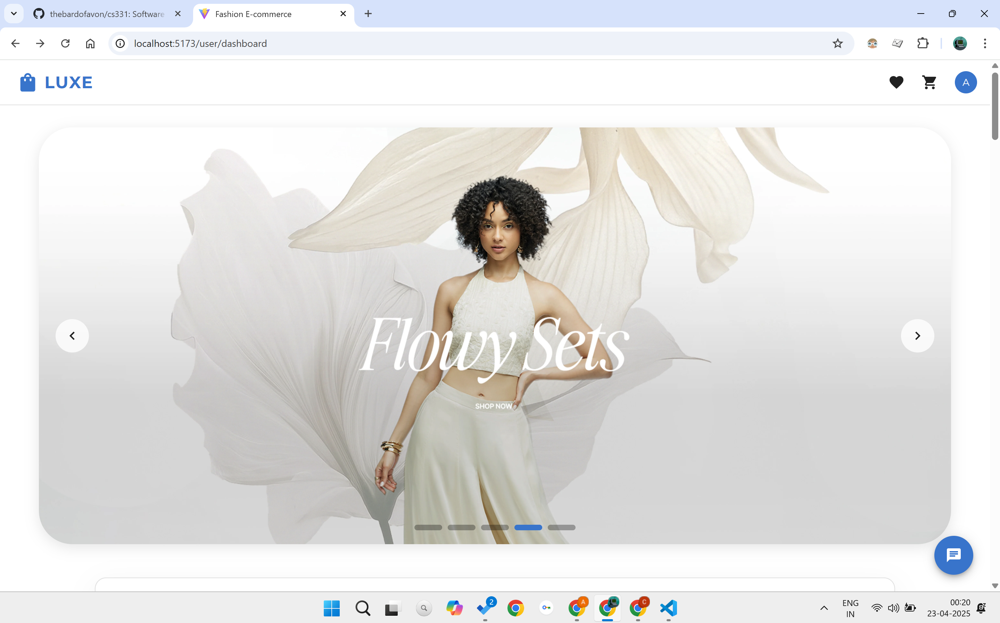
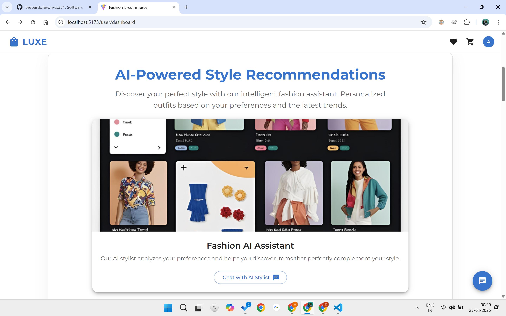
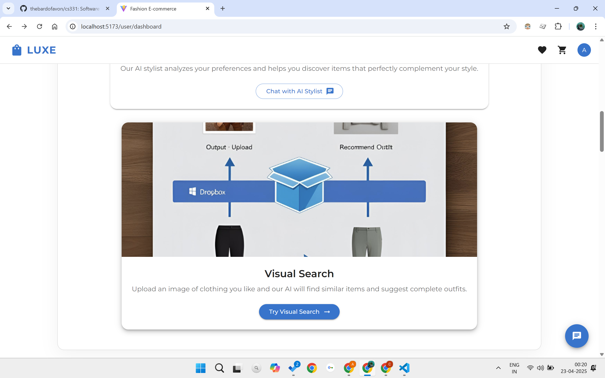
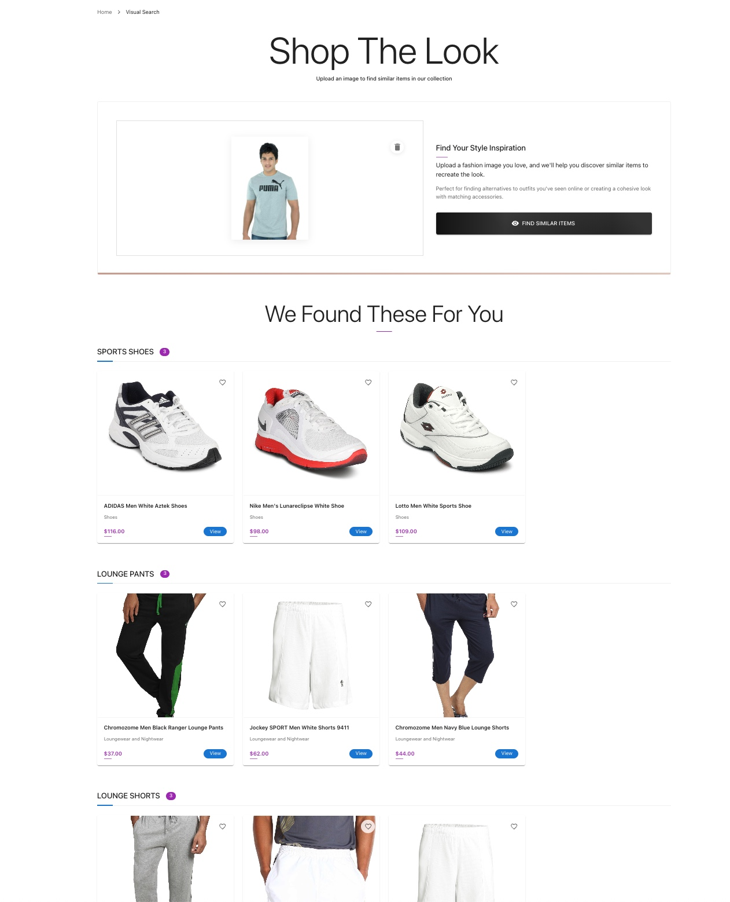
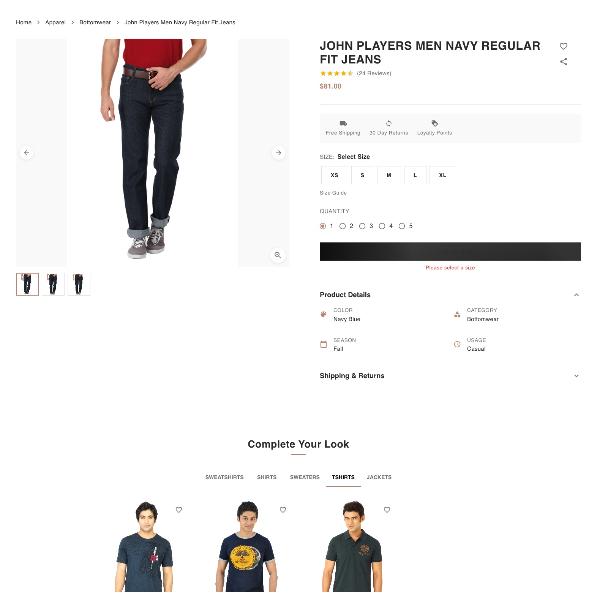
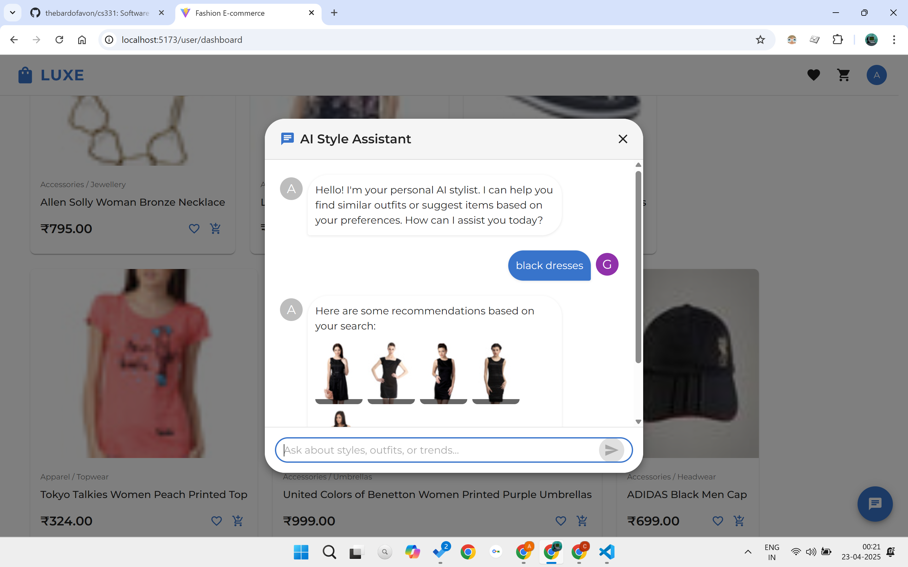

# RAG: Outfit Recommendation System

**AI-Driven Outfit Recommendations with Advanced Search Capabilities**

*Department of Computer Science and Engineering, Indian Institute of Information Technology Guwahati*

## Abstract

This project delivers a full-stack fashion e-commerce platform that implements advanced outfit recommendations and sophisticated search. Our solution employs architecture with a **Retrieval-Augmented Generation (RAG)** framework that employs state-of-the-art machine learning, including **OpenAI CLIP** for multimodal understanding and **Maximal Marginal Relevance (MMR)** for diverse recommendations.

## 🎯 Motivation

Empower users to discover and explore outfit ideas tailored to their searches, using AI-driven image and text understanding, moving beyond sales to genuine style inspiration and intuitive interaction.

## 🏗️ Architectural Approach

### Microservices Architecture
- **Scalable Design**: Breaking the platform into independent services
- **Agility**: Platform design supports parallel development and rapid feature deployment
- **Quick Iterations**: Allowing quick tweaks to features and search algorithms

### Scalability & Resilience
- **Loose Coupling**: Ensures easy integration of components
- **High Availability**: Robust system design for consistent performance

## 🚀 Key Features

### Advanced Search Capabilities
- **RAG Architecture Integration**: Enhances search with information retrieval from the product database
- **Multimodal Embeddings (OpenAI CLIP)**: Generate unified image and text embeddings for deep semantic understanding
- **Cross-Modal Search**: Enable attribute prediction (e.g., garment, article type, color) and cross-modal search functionality

### Intelligent Recommendation Engine
- **TF-IDF**: Weighs textual feature importance for content-based recommendations
- **One-Hot Encoding**: Encodes categorical features for similarity calculations
- **Similarity Search (Annoy)**: Fast Approximate Nearest Neighbors (ANN) search using cosine similarity for real-time recommendations

### Recommendation Strategy
- **MMR (Maximal Marginal Relevance)**: Balances relevance and diversity in recommendations
- **K-Means Clustering**: Detects dominant colors for outfit compatibility scoring

## 📊 Performance Results

Our system demonstrates significant improvements over baseline models:

| Metric | Value | Improvement |
|--------|-------|-------------|
| NDCG@5 | 0.991 | 15.37% |
| Novelty | 0.947 | 2.85% |

### Industry Comparison
The system shows superior performance compared to existing fashion e-commerce platforms in key areas:
- **Multimodal Search**: Enhanced accuracy in product discovery
- **Personalization**: Improved user experience through AI-driven recommendations
- **Search Quality**: Better semantic understanding and relevance

## 🛠️ Technical Stack

### Machine Learning & AI
- **OpenAI CLIP**: Multimodal embeddings for image-text understanding
- **TF-IDF**: Text feature importance weighting
- **Annoy**: Approximate Nearest Neighbors for fast similarity search
- **K-Means**: Color clustering for compatibility analysis

### Architecture Components
- **RAG Framework**: Retrieval-Augmented Generation for enhanced search
- **Microservices**: Scalable and maintainable service architecture
- **MMR Algorithm**: Maximal Marginal Relevance for diverse recommendations

## 🎯 Core Capabilities

1. **Smart Product Discovery**: AI-driven search that understands both images and text queries
2. **Personalized Recommendations**: Tailored outfit suggestions based on user preferences
3. **Cross-Modal Understanding**: Search using images to find similar or complementary items
4. **Color Compatibility**: Intelligent color matching for outfit coordination
5. **Real-Time Performance**: Fast recommendation engine for seamless user experience

## 📈 System Benefits

- **Enhanced User Experience**: Smarter, more personalized outfit discovery
- **Improved Search Accuracy**: 15.37% improvement in NDCG@5 scores
- **Scalable Architecture**: Microservices design supports growth and feature expansion
- **AI-Powered Insights**: Deep understanding of fashion preferences and trends

## 🔍 Use Cases

- **Style Discovery**: Help users find new fashion styles and outfit combinations
- **Visual Search**: Search for products using images instead of text
- **Outfit Coordination**: Suggest complementary items for complete outfits
- **Personalized Shopping**: Tailored recommendations based on individual preferences
- **Color Matching**: Find items that work well together color-wise

## 📚 References

1. Radford, A., et al. "Learning Transferable VIM From NL Supervision." ICML, 2021.
2. Bernhardsson, E. "Annoy: Approximate Nearest Neighbors in C++/Python." GitHub Repo, 2023.

## 👥 Contributors

**Ahlad Pataparla, Anushka Srivastava, Arya Sahu, Khushi Mandal**

Department of Computer Science and Engineering  
Indian Institute of Information Technology Guwahati

---

*This project represents cutting-edge research in AI-driven fashion e-commerce, combining advanced machine learning techniques with practical applications for enhanced user experience in online fashion retail.*
# LUXE - Premium Fashion E-Commerce Platform

<!--  -->

## 🌟 Overview

LUXE is a modern, feature-rich e-commerce platform designed for premium fashion retail. Leveraging state-of-the-art web technologies and AI-powered recommendations, LUXE delivers an exceptional shopping experience for customers while providing powerful management tools for administrators.

## ✨ Features

### User Features
- **User Authentication** - Secure login and registration system
- **Product Browsing** - Explore products with advanced filtering and search capabilities
- **Product Recommendations** - AI-powered product suggestions based on user preferences
- **Visual Search** - Upload images to find similar fashion items
- **Shopping Cart** - Add items, manage quantities, and checkout
- **Wishlist** - Save favorite items for future consideration
- **Order Management** - Track order status, view order history
- **User Profile** - Manage personal information, addresses, and preferences

### Admin Features
- **Admin Dashboard** - Comprehensive overview of store performance
- **Inventory Management** - Add, edit, and remove products
- **Order Processing** - View and update order statuses
- **Analytics** - Track sales, inventory levels, and user activity
- **Category Management** - Organize products into customizable categories

## 🛠️ Technology Stack

### Frontend
- **React** - UI library for building the user interface
- **Redux Toolkit** - State management solution
- **React Router** - Routing and navigation
- **Material UI** - Component library for modern, responsive design

### Backend (API Integration)
- RESTful API integration with comprehensive endpoints for:
  - User authentication
  - Product management
  - Cart and order handling
  - Wishlist functionality
  - Image processing for visual search

## 📋 Project Structure

```
src/
├── app/
│   └── store.js              # Redux store configuration
├── components/
│   ├── common/               # Shared UI components
│   └── layout/               # Layout components like NavBar
├── features/
│   ├── admin/                # Admin dashboard and management
│   ├── auth/                 # Authentication functionality
│   ├── cart/                 # Shopping cart
│   ├── orders/               # Order management
│   ├── payment/              # Payment processing
│   ├── products/             # Product catalog
│   ├── saveForLater/         # Save for later functionality
│   ├── user/                 # User dashboard and profile
│   └── wishlist/             # Wishlist functionality
├── services/
│   └── apiClient.js          # API service integration
└── utils/                    # Utility functions
```
<!-- 
## 🚀 Getting Started

### Prerequisites
- Node.js (v14 or later)
- npm or yarn

### Installation

1. Clone the repository
```bash
git clone https://github.com/yourusername/luxe-ecommerce.git
cd luxe-ecommerce
```

2. Install dependencies
```bash
npm install
# or
yarn install
```

3. Start the development server
```bash
npm run dev
# or
yarn dev
```

4. Open your browser and navigate to `http://localhost:5173` -->

## 📸 Screenshots

### User Interface

#### Home Page

*The welcoming homepage showcasing featured products and categories*

#### Fashion AI Assistant

*Chat with Fashion AI Assistant to find products in our catalog that go well with your choices*

#### Visual Search

*Upload an image to find similar products in our catalog*

<!-- #### Product Detail

*Detailed product view with all information and related recommendations* -->

<!-- #### Shopping Cart

*User-friendly shopping cart interface* -->

<!-- ### Admin Interface

#### Admin Dashboard

*Comprehensive admin dashboard with store performance metrics*

#### Product Management

*Interface for managing product inventory* -->

## 🌟 Key Features Showcase

### Visual Search

*Upload an image to find similar products in our catalog*

### AI-Powered Recommendations

*Get personalized product recommendations based on your preferences*

#### Fashion AI Assistant

*Chat with Fashion AI Assistant to find products in our catalog that go well with your choices*

## 🔐 Authentication

The application features a robust authentication system:
- User registration and login
- Admin-specific authentication
- Protected routes for secure access

## 📱 Responsive Design

LUXE is built with a mobile-first approach, ensuring a seamless experience across all devices:
- Responsive layout adapts to any screen size
- Touch-friendly interface for mobile users
- Optimized performance on all devices

## 🙏 Acknowledgements

- Material UI for the component library
- Redux team for the state management tools
- React Router for navigation capabilities
- All the contributors who have helped shape this project

---

© 2025 LUXE Fashion Marketplace. All rights reserved.